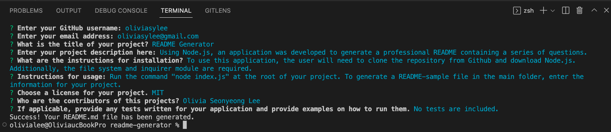

# README Generator
## Description
Using Node.js, an application was developed to generate a professional README containing a series of questions.

## Installation
To use this application, the user will need to clone the repository from GitHub and download Node. Additionally, the file system and inquirer module are required.

`npm init`

`npm i inquirer@8.2.4`
## Usage
Here is a full movie showing how the application works: [Click here](https://drive.google.com/file/d/15lKOLtgPzJTrjJgrrsRjk0thSZhO1eGP/view)  

### Application Interface

Run the command below at the root of your project.

`node index.js`

To generate a README-sample file in the main folder, enter the information for your project.

## Questions
If you have any questions about this projects, please contact me at oliviasylee@gmail.com. You can view more of my projects at https://github.com/oliviasylee.
